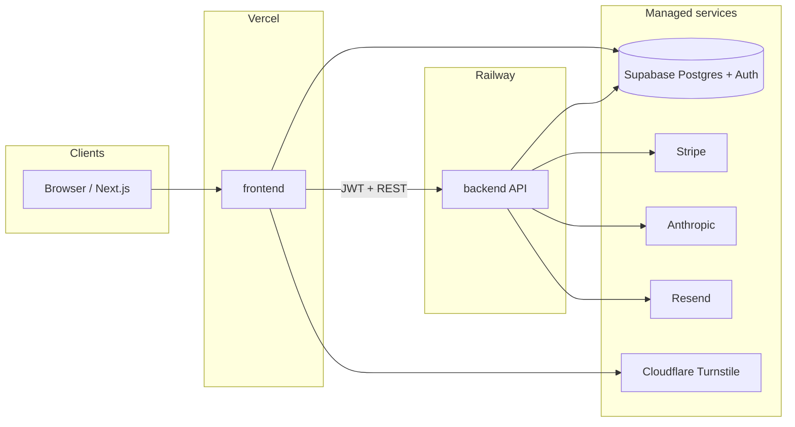

# Good Night Games

A multi-game entertainment platform built as a TypeScript monorepo. **Survey Showdown** is the first shipped title—a team-based survey guessing game with token economy, custom surveys, AI judging, and full account lifecycle (auth, purchases, referrals).

| | |
|---|---|
| **Frontend** | Next.js 16 (App Router), React 19, Tailwind CSS 4 — deployed on Vercel |
| **Backend** | Hono on Node.js — deployed on Railway (`backend/` as root directory) |
| **Data** | Supabase PostgreSQL with Row Level Security; Prisma ORM + Accelerate |
| **Auth** | Supabase Auth (email/password, Google OAuth, magic link) |
| **Payments** | Stripe (Checkout, webhooks, token bundles) |
| **AI** | Claude Haiku (server-side judge only; API key never exposed to clients) |
| **CI** | GitHub Actions — TypeScript check and Vitest on every push/PR |

Package versions are kept in sync across `frontend/` and `backend/` (currently **0.13.0**).

---

## Table of contents

- [Architecture](#architecture)
- [Repository layout](#repository-layout)
- [Prerequisites](#prerequisites)
- [Local development](#local-development)
- [Environment configuration](#environment-configuration)
- [API surface](#api-surface)
- [Database and migrations](#database-and-migrations)
- [Testing](#testing)
- [Continuous integration](#continuous-integration)
- [Deployment](#deployment)
- [Documentation](#documentation)
- [Security](#security)
- [Contributing](#contributing)

---

## Architecture



**Request flow (authenticated):** the browser holds a Supabase session; the frontend sends the JWT in `Authorization` on API calls. The backend validates tokens with the Supabase service role and never trusts client-supplied user IDs. Game-specific routes are namespaced under `/api/survey-showdown/`; product-wide routes live under `/api/auth/`, `/api/tokens/`, `/api/referrals/`, and `/api/feedback`.

**Environments:**

| Environment | Supabase project | Stripe |
|-------------|------------------|--------|
| Local | `good-night-games-staging` | Test keys |
| Staging | `good-night-games-staging` | Test keys |
| Production | `good-night-games-production` | Live keys |

Local and staging intentionally share one Supabase project; run Prisma migrations once per schema change to cover both.

---

## Repository layout

```
good-night-games/
├── frontend/          # Next.js app (Survey Showdown UI)
├── backend/           # Hono API, Prisma schema, migrations
│   ├── prisma/        # Schema and SQL migrations
│   ├── src/           # Routes, middleware, lib
│   └── docs/          # Database routines, Supabase SQL runbooks
├── shared/            # Optional shared TypeScript types (add when needed)
├── scripts/           # Release automation (prepare-release.sh / .ps1)
├── .github/workflows/ # CI pipeline
└── .cursor/rules/     # Project conventions for AI-assisted development
```

There is **no root `package.json`**. Install dependencies independently in `frontend/` and `backend/`.

---

## Prerequisites

- **Node.js 20+** (matches CI)
- **npm** (lockfiles committed per package)
- Access to a **Supabase** project (staging for local dev)
- **Stripe** test account, **Anthropic** API key, and **Resend** sender (for full backend feature parity locally)
- **Cloudflare Turnstile** test keys paired between frontend site key and backend secret

---

## Local development

### 1. Clone and install

```bash
git clone <repository-url>
cd good-night-games

cd backend && npm ci
cd ../frontend && npm ci
```

### 2. Configure environment

```bash
# Backend
cp backend/.env.example backend/.env
# Edit backend/.env — DATABASE_URL, Supabase keys, Stripe, etc.

# Frontend
cp frontend/.env.example frontend/.env.local
# Set NEXT_PUBLIC_* keys and NEXT_PUBLIC_BACKEND_URL=http://localhost:3001
```

`FRONTEND_URL` in the backend must match the URL you open in the browser (including port). For local-only work you may set `STAGING_ENFORCE_ORIGIN=false` to relax origin checks.

### 3. Database

From `backend/`:

```bash
npx prisma migrate dev    # apply migrations to your DATABASE_URL
npx prisma generate       # refresh Prisma Client after schema changes
```

### 4. Run services

Terminal A — API (default port **3001**):

```bash
cd backend
npm run dev
```

Terminal B — web app (default port **3000**):

```bash
cd frontend
npm run dev
```

Open [http://localhost:3000](http://localhost:3000). The home route redirects to `/survey-showdown`.

**Health check:** `GET http://localhost:3001/health` → `{ "status": "ok" }`.

### Mock mode

Set `NEXT_PUBLIC_MOCK_MODE=true` in `frontend/.env.local` to enable dev-only simulate buttons (email verification, referral claims, etc.). This variable must be absent in production builds so those branches compile out.

---

## Environment configuration

| Location | Purpose |
|----------|---------|
| `backend/.env` | Server secrets — never commit |
| `backend/.env.example` | Committed template for all backend variables |
| `frontend/.env.local` | Client-safe `NEXT_PUBLIC_*` and staging basic auth |
| `frontend/.env.example` | Committed template |

Key backend variables: `DATABASE_URL`, `DIRECT_URL`, `SUPABASE_*`, `STRIPE_*`, `ANTHROPIC_API_KEY`, `RESEND_API_KEY`, `TURNSTILE_SECRET_KEY`, `FRONTEND_URL`, `SIGNUP_BONUS_TOKENS`, `REFERRAL_TOKENS`, `MAX_REFERRALS`.

Key frontend variables: `NEXT_PUBLIC_SUPABASE_URL`, `NEXT_PUBLIC_SUPABASE_ANON_KEY`, `NEXT_PUBLIC_BACKEND_URL`, `NEXT_PUBLIC_STRIPE_PUBLISHABLE_KEY`, `NEXT_PUBLIC_TURNSTILE_SITE_KEY`, optional AdSense toggles.

When changing referral caps, update both `MAX_REFERRALS` in the backend and `product_policy.max_referrals` in the database (see migration `20260522180000_referral_signup_cap`).

---

## API surface

| Namespace | Scope | Examples |
|-----------|--------|----------|
| `/api/config` | Product policy | Public config, token rules |
| `/api/auth` | Authentication | Signup, verification |
| `/api/tokens` | Token economy | Spend, balance, Stripe webhook |
| `/api/tokens/bundles` | Commerce | Bundle catalog |
| `/api/referrals` | Growth | Claim referral rewards |
| `/api/feedback` | Support | Per-game feedback |
| `/api/survey-showdown/packs` | Game content | Official survey packs |
| `/api/survey-showdown/custom-surveys` | User content | Custom surveys and collections |
| `/api/survey-showdown/judge` | Gameplay | AI judge (cached) |
| `/api/survey-showdown/history` | Gameplay | Session history (50-record window) |

All mutating endpoints validate input with **Zod** and return structured `400` errors on failure. Protected routes require a valid Supabase JWT.

Future games should add their own prefix (e.g. `/api/word-blitz/`) and must not place game logic in product-level routes.

---

## Database and migrations

- **ORM:** Prisma models in `backend/prisma/schema.prisma`
- **Migrations:** `backend/prisma/migrations/` — create with `npx prisma migrate dev --name <descriptive-name>`
- **Never edit** applied migration files
- **Supabase routines/triggers:** maintained in `backend/docs/supabase-public-routines.sql` and mirrored into migrations; follow [backend/docs/database-routines-workflow.md](backend/docs/database-routines-workflow.md) for edit, migrate, deploy, and verification

Shared tables use neutral names (`users`, `tokens`, `referrals`, `game_sessions`, `judge_cache`). Survey Showdown tables are prefixed (`su_*`). `game_sessions.game_id` and history writes use `"survey_showdown"` for this title.

---

## Testing

```bash
# Backend — unit and route tests (Vitest)
cd backend
npm test
npx tsc --noEmit

# Frontend — component and API client tests (Vitest)
cd frontend
npm test
```

Run both suites before opening a PR. CI currently executes backend `tsc` and Vitest from `.github/workflows/ci.yml`; extend the workflow if frontend tests should gate merges.

---

## Continuous integration

Workflow: [`.github/workflows/ci.yml`](.github/workflows/ci.yml)

On every push and pull request:

1. `npm ci` in `backend/`
2. `npx tsc --noEmit`
3. `npx vitest run`

---

## Deployment

| Component | Platform | Notes |
|-----------|----------|--------|
| **API** | Railway | Set root directory to `backend/`; configure all variables from `.env.example` |
| **Web** | Vercel | Build `frontend/`; set `NEXT_PUBLIC_*` per environment |
| **Database** | Supabase | Run `npx prisma migrate deploy` against staging, then production |

**Staging safeguards:** origin guard middleware restricts API access to configured front-end origins; preview URLs can be listed in `ALLOWED_ORIGINS`.

**Release process:** use `scripts/prepare-release.sh` (macOS/Linux) or `scripts/prepare-release.ps1` (Windows) for semver bumps and release branches from `develop` (see `.cursor/skills/prepare-release/` for agent guidance).

Post-deploy for SQL routine changes: run drift-check queries documented in [database-routines-workflow.md](backend/docs/database-routines-workflow.md).

---

## Documentation

| Document | Description |
|----------|-------------|
| [backend/docs/database-routines-workflow.md](backend/docs/database-routines-workflow.md) | Supabase functions, triggers, migrate/deploy checklist |
| [backend/docs/supabase-public-routines.sql](backend/docs/supabase-public-routines.sql) | Canonical SQL for public routines |
| [backend/docs/referral-status-enum-supabase-sql.md](backend/docs/referral-status-enum-supabase-sql.md) | Referral enum and smoke-test checklist |
| `.cursor/rules/survey-showdown.mdc` | Game flow, design system, API conventions, phase plan |

---

## Security

- **Secrets** stay server-side: service role key, Stripe secret, Anthropic key, Turnstile secret, Resend API key
- **RLS** on Supabase: users only access their own surveys and token data
- **JWT validation** on every protected API route
- **No PII** in application logs
- **Turnstile** on sensitive auth flows; test keys must pair site key and secret documented in `.env.example`
- **CORS** limited to `FRONTEND_URL` (and explicit `ALLOWED_ORIGINS` on staging)

Report security issues through your team's private channel, not public issues, if the repository is private.

---

## Contributing

1. Branch from `develop` (or team default)
2. Keep changes focused; match existing TypeScript and file layout conventions
3. Add or update tests for behavior changes
4. Run backend and frontend test suites locally
5. For schema changes: Prisma migration plus update routine docs if triggers or functions change
6. Open a PR with a clear summary and test plan

**Conventions:** functional React components, Zod on all API inputs, CSS variables for design tokens (no hardcoded palette), `<TokenSVG />` instead of coin emoji, and `startGame` then `commitGame` for token spend (never bypass).

---

## Product roadmap

Implementation follows a phased plan (frontend UI complete; backend and integrations ongoing). See `.cursor/rules/survey-showdown.mdc` for phase status and guardrails when adding Stripe, auth, or judge integrations.

---

**Good Night Games** — original survey-party entertainment. Survey content and mechanics are wholly original; no third-party survey databases or trademarked show formats are used.
